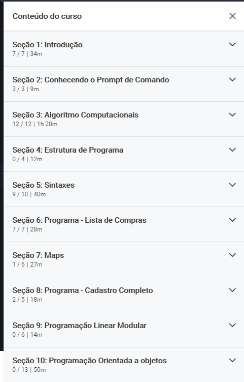

# dart_logica_de_programacao
Cursos da Udemy  Logica de programação [Udemy](https://www.udemy.com/share/1022bCB0Qac1dbR3w=/)

Conteúdo curso:

baixar vsCode [link](https://code.visualstudio.com/)

**Semântica** : O que as coisas significam ou fazem.  

**Sintaxe**: Como deve ser escrito.  

